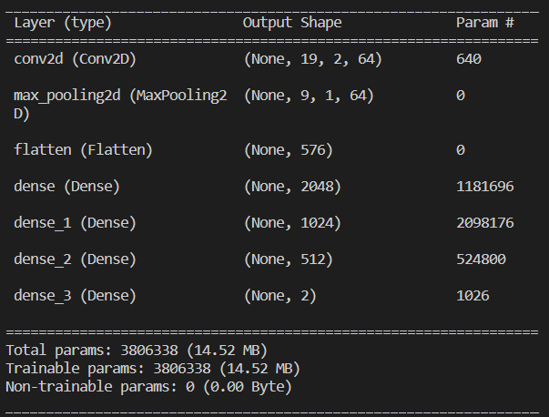

# tinypredictor

Predict the winner of a League of Legends game from the game state.

## Game State Representation
Overview of the representation of the game state considered:
- **Champions** 
  - (Champion ID | Level | Score (kills / deaths) | Gold)
  - For each of the 10 champions on each team   (10x4)
- **Towers destroyed** (for each team)              (2x4)
- **Inhibitors destroyed** (for each team)          (2x4)
- **Champions killed** (for each team)              (2x4)
- **Drakes killed** (for each team)                 (2x4)
- **Barons killed** (for each team)                 (2x4)
- **Game Duration**                                 (1x4)

This leads to each game state being represented by a 21x4 image. 

## Model

## TODO(s):
- Get the state of the game from an arbitrary instant of each game instead of just the final game state (Important)
  
